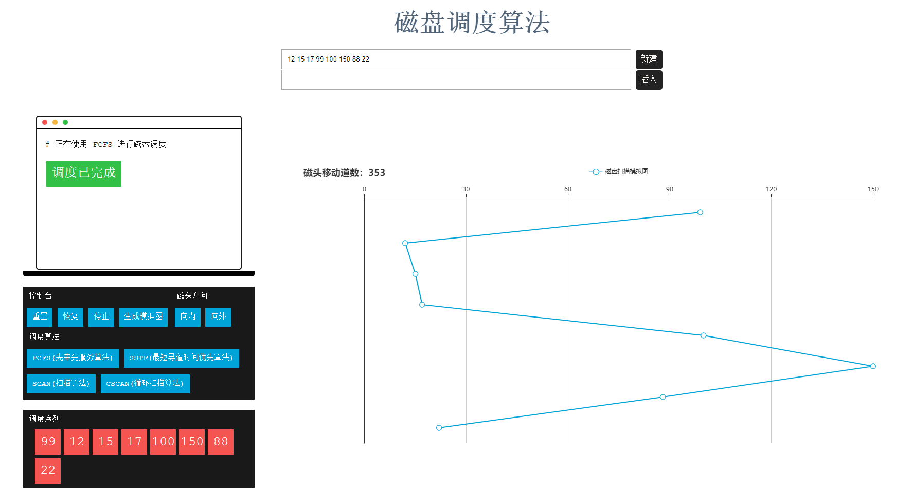

# 磁盘调度模拟算法

*对磁盘调度算法的改善 ~~（好吧其实又是个程序大作业）~~*

#### 需求如下

设计与模拟实现一个磁盘调度模拟系统，加深对操作系统的磁盘调度管理知识的理解和掌握磁盘调度工作原理。要求：

1. 查阅相关资料，了解操作系统中的磁盘调度算法，如先来先服务算法（FCFS）、最短寻道时间优先算法（SSTF）、扫描算法（SCAN）、循环扫描算法（CSCAN）等。

2. 设计一个模拟的磁盘调度系统，支持将磁头初始磁道号、序列长度、磁道号序列等数据从键盘或文件获取。

3. 模拟实现的磁盘调度系统至少支持三种磁盘调度算法，最好能支持磁道号序列中磁道号的动态增加。

4. 模拟磁盘调度的工作过程，并会分析调度算法的性能。

5. 设计简单的交互界面，演示所设计的功能。

6. 可根据自己能力，在完成以上基本要求后，对程序功能进行适当扩充。

7. 撰写报告，对所采用的算法、程序结构和主要函数过程以及关键变量进行详细的说明；对程序的调试过程所遇到的问题进行回顾和分析，对测试和运行结果进行分析；总结软件设计和实习的经验和体会，进一步改进的设想。

8. 提供关键程序的清单、源程序及可执行文件和相关的软件说明。

#### 演示结果

